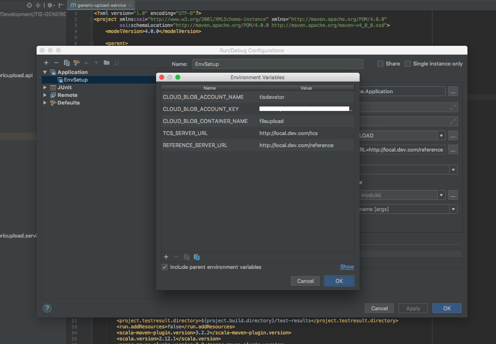

# TIS-GENERIC-UPLOAD

## How to use this service

This service is controlled through environment variables, so there is no need to
mess with any configuration files. While doing development locally, the following environment 
variables have to be set

* `CLOUD_BLOB_ACCOUNT_NAME`: the user name of the Azure storage container
* `CLOUD_BLOB_ACCOUNT_KEY`: the 'secret' key/password associated with the above account name
* `CLOUD_BLOB_CONTAINER_NAME`: folder in container to store files into


* `TCS_SERVER_URL`: the URL of TCS within the appropriate environment
* `REFERENCE_SERVER_URL`: the URL of REFERENCE within the appropriate environment

In other environments, the service uses [additional](https://github.com/Health-Education-England/TIS-DEVOPS/blob/master/ansible/roles/docker-compose/templates/generic-upload/docker-compose.yml#L23-#L47) environment variables to control configuration such as databases and ports, beyond the scope of this document.

These environment can either be set on the OS shell using the export command (UNIX), then run the service using

```mvn spring-boot:run```

__OR__

as environment variables set in the IDE as below; 

select com.transformuk.hee.tis.genericupload.service.Application as the application class 
to be run and this should allowed the service to be started/debugged as usual 



This service relies on the following services and Infrastructure

**Services**
* tcs
* reference
* profile - Ensure the keycloak user used to login is assigned to the `BulkUploadAdmin` group
* admin-ui - [link](http://local.dev.com/admin/uploads) to bulk upload running locally when admin-ui is running

**Infrastructure - documented below for local development environment**
* mysql - a database `genericupload` needs to be created in the mysql server that the service has access to; (refer to [confluence](https://hee-tis.atlassian.net/wiki/spaces/TISDEV/pages/13402197/Development+set+up+on+Mac#DevelopmentsetuponMac-Createdatabases) for how this is done on 
other TIS projects)
* nginx - a new nginx rule needs to be add to the nginx service to allow generic upload requests to be proxied via nginx; (refer to [confluence](https://hee-tis.atlassian.net/wiki/spaces/TISDEV/pages/13402197/Development+set+up+on+Mac#DevelopmentsetuponMac-ConfigureyourNGINXproxy) for how this is done on 
other TIS projects)

The following role was added to the local nginx configuration on OSX
>```
>location /generic-upload {
>  proxy_pass http://127.0.0.1:8099;
>  proxy_set_header OIDC_access_token $token; 
>  proxy_pass_request_headers on;
>}
>```


**Uploading a revised template**

Refer to [confluence](https://hee-tis.atlassian.net/wiki/spaces/TISDEV/pages/427917389/Bulk+Uploads+templates+storage+Azure)

### DESIGN

**Convert data from excel to a bean**

[ExcelToObjectMapper](https://github.com/Health-Education-England/TIS-GENERIC-UPLOAD/blob/master/generic-upload-service/src/main/java/com/transformuk/hee/tis/genericupload/service/parser/ExcelToObjectMapper.java) This 
class is the first step of the conversion from tabular/excel data, from a [template](https://hee-tis.atlassian.net/wiki/spaces/TISDEV/pages/532709384/TIS+Bulk+Upload+Templates), to a [bean](https://github.com/Health-Education-England/TIS-GENERIC-UPLOAD/blob/master/generic-upload-api/src/main/java/com/transformuk/hee/tis/genericupload/api/dto/PersonXLS.java) using a [mapper](https://github.com/Health-Education-England/TIS-GENERIC-UPLOAD/blob/master/generic-upload-service/src/main/java/com/transformuk/hee/tis/genericupload/service/parser/PersonHeaderMapper.java) which takes the name from the header on the template and loads the data to a fieldname on the bean

Key features to highlight of the class
* extra columns and column ordering are ignored 
* mandatory columns are specified with an asterisk against the header

Non-input fields (not on the circulated excel template) used to report on success/errors are stored in a [super class](https://github.com/Health-Education-England/TIS-GENERIC-UPLOAD/blob/master/generic-upload-api/src/main/java/com/transformuk/hee/tis/genericupload/api/dto/TemplateXLS.java) and have a role in [reporting](https://github.com/Health-Education-England/TIS-GENERIC-UPLOAD/blob/7b2332ce235251f0937145328eb69b4bbb2df10f/generic-upload-service/src/main/java/com/transformuk/hee/tis/genericupload/service/service/ScheduledUploadTask.java#L134-L156)

**Transforming to and uploading DTO data**

The transformation of data happens in the Service classes, [PersonTransformerService](https://github.com/Health-Education-England/TIS-GENERIC-UPLOAD/blob/363828cb316bc0f3ff0f7a4e282f62e20f21d7f1/generic-upload-service/src/main/java/com/transformuk/hee/tis/genericupload/service/service/PersonTransformerService.java) for example. At the time of writing, two other Service classes PlacementTransformerService and PlacementDeleteService are also used to bulk upload & delete placement data respectively. 

The [FETCHER](https://github.com/Health-Education-England/TIS-GENERIC-UPLOAD/blob/master/generic-upload-service/src/main/java/com/transformuk/hee/tis/genericupload/service/service/fetcher/DTOFetcher.java) 
class allows bulk DTOs to be fetched. Refer to previous versions of the class to see simplified versions of the code, and the code it replaced prior to the refactor. Given a field like GMC number, extending classes such as GDCDTOFetcher, retrieve DTOs in batches. For example, given an excel sheet with 1000's of GMC rows, the class will break it up into chunks of 32 ([supposedly efficient](https://www.techempower.com/blog/2016/10/19/efficient-multiple-stream-concatenation-in-java/) for a flat-map reduce), and query using the TCS [client](https://github.com/Health-Education-England/TIS-TCS/blob/c4e46d9475dbc1b07337c205e00870988ab0225c/tcs-client/src/main/java/com/transformuk/hee/tis/tcs/client/service/impl/TcsServiceImpl.java#L340-L345), the GMC details. Batching vastly decreases the number of REST calls. The retrieved data set is stored in a map (lookup) class and the ID function determines what field to use for the Key.

**Frontend API**

The [api](https://github.com/Health-Education-England/TIS-GENERIC-UPLOAD/blob/master/generic-upload-service/src/main/java/com/transformuk/hee/tis/genericupload/service/api/UploadFileResource.java) to generic upload consists of endpoints to upload a file and query the results of uploaded files. 

Results from the upload are stored in the database. In the case of errors, the original file is retrieved from Azure and successful lines are removed from the uploaded template. An additional column, displaying errors encountered during an upload for each line not uploaded, is added to the file. The workflow assumed is that a user would download the file with errors reported and reupload after fixing the errors.

### TODO

**Remove dead code associated with the service being made generic; on the very first commit**
* anything associated with azure queues POCs `com.transformuk.hee.tis.genericupload.service.service.EventBusService`
* spring batch code as the service uses a [Scheduler](https://github.com/Health-Education-England/TIS-GENERIC-UPLOAD/blob/7b2332ce235251f0937145328eb69b4bbb2df10f/generic-upload-service/src/main/java/com/transformuk/hee/tis/genericupload/service/Application.java#L46) `com.transformuk.hee.tis.genericupload.service.config.steps.PeopleSteps`
* the [ETL Service](https://github.com/Health-Education-England/TIS-GENERIC-UPLOAD/blob/fa32d014394ebf394773e7d10fad6f3e8d6739a5/generic-upload-service/src/main/java/com/transformuk/hee/tis/genericupload/service/service/EtlService.java#L26) code; the [File Process Service](https://github.com/Health-Education-England/TIS-GENERIC-UPLOAD/blob/cf54a659bbeaab97ad65c5743859aa3278d1cef0/generic-upload-service/src/main/java/com/transformuk/hee/tis/genericupload/service/service/impl/FileProcessServiceImpl.java#L38) code;
* anything associated with [Mapper](https://github.com/Health-Education-England/TIS-GENERIC-UPLOAD/blob/55fb4a783fd23818d9bd07a9c9123e95a421f994/generic-upload-service/src/main/java/com/transformuk/hee/tis/genericupload/service/config/PeopleMapperConfiguration.java#L32)
* unused JHipster boilerplate code 

### TODO - Documentation

* document Azure logId debugging
