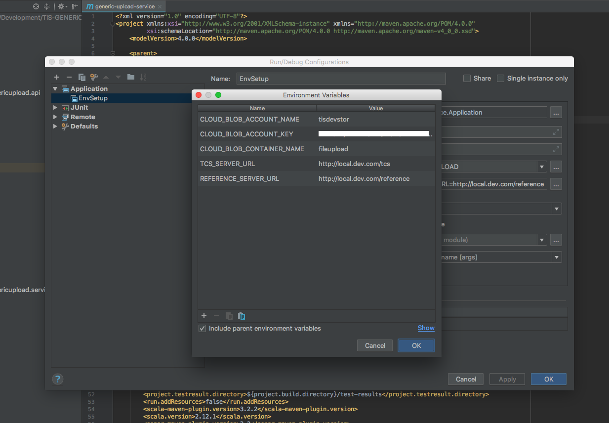

# TIS-GENERIC-UPLOAD

## How to use this service
This service is controlled through environment variables, avoid changing configuration files in a way that would not want to be committed.

### AWS configuration
When running with a custom profile, the cloud storage bucket can be configured using
`GENERIC_UPLOAD_AWS_BUCKET_NAME`.  This defaults to a predefined bucket for local deployment.

Environment variables or configuration isused to grant access to the bucket.

### Azure configuration (unsupported)
While doing development locally, the following environment variables have to be set

* `CLOUD_BLOB_ACCOUNT_NAME`: the user name of the Azure storage container
* `CLOUD_BLOB_ACCOUNT_KEY`: the 'secret' key/password associated with the above account name
* `CLOUD_BLOB_CONTAINER_NAME`: folder in container to store files into


* `TCS_SERVER_URL`: the URL of TCS within the appropriate environment
* `REFERENCE_SERVER_URL`: the URL of REFERENCE within the appropriate environment

Get the CLOUD_BLOB_ACCOUNT_KEY from azure. Go to Storage accounts > tisdevstor > Access keys

In other environments, the service uses environment variables to control configuration such as databases and ports, beyond the scope of this document.

These environment variables can either be set on the OS shell using the export command (UNIX), then run the service using

```shell
cd generic-upload-service
mvn spring-boot:run
```

__OR__

as environment variables set in the IDE as below; 

1. Open the Run/Debug Configurations
2. Select com.transformuk.hee.tis.genericupload.service.Application as the application class
3. Add any environment variables you wish to change 
  
4. This should allow the service to be started/debugged as usual

This service relies on the following services and Infrastructure.
The expectation is that they are all provided by the dev environment setup:

**Services**
* tcs
* assessments
* reference
* profile - Ensure the keycloak user used to login is assigned to the `BulkUploadAdmin` group
* admin-ui - [link](http://localhost/admin/uploads) to bulk upload running locally when admin-ui is running

**Infrastructure - documented below for local development environment**
* mysql - a database `genericupload` needs to be created in the mysql server that the service has access to; (refer to [confluence](https://hee-tis.atlassian.net/wiki/spaces/TISDEV/pages/13402197/Development+set+up+on+Mac#DevelopmentsetuponMac-Createdatabases) for how this is done on 
other TIS projects)
* nginx (optional, as in dev environemnt setup)
* Cloud storage (e.g. S3 or localstack)

**Uploading a revised template**

Refer to the wiki "Bulk Upload Templates" for instructions.

## DESIGN

**Convert data from excel to a bean**

[ExcelToObjectMapper](./generic-upload-service/src/main/java/com/transformuk/hee/tis/genericupload/service/parser/ExcelToObjectMapper.java) This class is the first step of the conversion from tabular/excel data,
 from a [file](./generic-upload-service/src/test/resources/TIS%20People%20Import%20Template%20-%20empty%20row.xlsx),
 to a [bean](./generic-upload-api/src/main/java/com/transformuk/hee/tis/genericupload/api/dto/PersonXLS.java)
 representation of the row.  The mapping is built using the [ColumnMapper](./generic-upload-service/src/main/java/com/transformuk/hee/tis/genericupload/service/parser/ColumnMapper.java).

Key features to highlight of the class
* extra columns and column ordering are ignored 
* by convention, mandatory columns are specified with an asterisk against the header

Non-input fields (not on the circulated excel template) used to report on success/errors are stored in a [super class](./generic-upload-api/src/main/java/com/transformuk/hee/tis/genericupload/api/dto/TemplateXLS.java) and have a role in [reporting](https://github.com/Health-Education-England/TIS-GENERIC-UPLOAD/blob/7b2332ce235251f0937145328eb69b4bbb2df10f/generic-upload-service/src/main/java/com/transformuk/hee/tis/genericupload/service/service/ScheduledUploadTask.java#L134-L156)

**Transforming to and uploading DTO data**

The transformation of data happens in the Service classes, [PersonTransformerService](./generic-upload-service/src/main/java/com/transformuk/hee/tis/genericupload/service/service/PersonTransformerService.java) for example. At the time of writing, there are 15 Transformers. 

The [FETCHER](./generic-upload-service/src/main/java/com/transformuk/hee/tis/genericupload/service/service/fetcher/DTOFetcher.java) 
class allows bulk DTOs to be fetched. Refer to previous versions of the class to see simplified
 versions of the code, and the code it replaced prior to the refactor. Given a field like GMC
 number, extending classes such as GMCDTOFetcher, retrieve DTOs in batches. For example, given an
 excel sheet with 1000's of GMC rows, the class will break it up into chunks of 32 ([supposedly efficient](https://www.techempower.com/blog/2016/10/19/efficient-multiple-stream-concatenation-in-java/)
 for a flat-map reduce), and query using the TCS [client](https://github.com/Health-Education-England/TIS-TCS/blob/c4e46d9475dbc1b07337c205e00870988ab0225c/tcs-client/src/main/java/com/transformuk/hee/tis/tcs/client/service/impl/TcsServiceImpl.java#L340-L345), the GMC details. Batching vastly
 decreases the number of REST calls. The retrieved data set is stored in a map (lookup) class and
 the ID function determines what field to use for the Key.

**Frontend API**

The [api](https://github.com/Health-Education-England/TIS-GENERIC-UPLOAD/blob/main/generic-upload-service/src/main/java/com/transformuk/hee/tis/genericupload/service/api/UploadFileResource.java) to generic upload consists of endpoints to upload a file and query the results of uploaded files. 

Results from the upload are stored in the database. In the case of errors, the original file is
 retrieved from Cloud Storage and successful lines are removed from the uploaded template. An
 additional column, displaying errors encountered during an upload for each line not uploaded, is
 added to the file. The workflow assumed is that a user would download the file with errors reported
 and reupload after fixing the errors.

### TODO

* **Remove dead code associated with the service being made generic; on the very first commit**
* anything associated with azure queues POCs `com.transformuk.hee.tis.genericupload.service.service.EventBusService`
* the [File Process Service](./generic-upload-service/src/main/java/com/transformuk/hee/tis/genericupload/service/service/impl/FileProcessService.java)
 code. It appears the implementation has been removed.

### TODO - Documentation

* document cloud storage logId debugging
